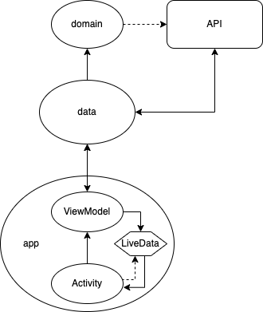

# RSS-Feed

Android app for showcasing my coding practices, developed in line with well known clean code principles.

### Requirements:

Users should be able to:
- Add new RSS feeds by specifying an URL
- Remove existing feeds
- See added feeds
    - The RSS feed presentation should include the feed name, image and description
- Select a feed to open a screen containing the RSS feed items
    - The RSS feed item presentation should include the item name, image and description
- Select a feed item to access the related website/feed
    - The app can open an RSS item link in a WebView

Optionally, users can:
- Turn on notifications for new feed items, for subscribed RSS feeds
- Add RSS feeds to Favorites

Some requirements, such as design and optimization, are omitted on purpose. They can be implemented at will.

## Project structure

The following picture defines project structure and how information flows between layers of the application:
 

## Tech stack

- MVVM architecture
- Hilt
- LiveData
- Coroutines
- Retrofit
- Room